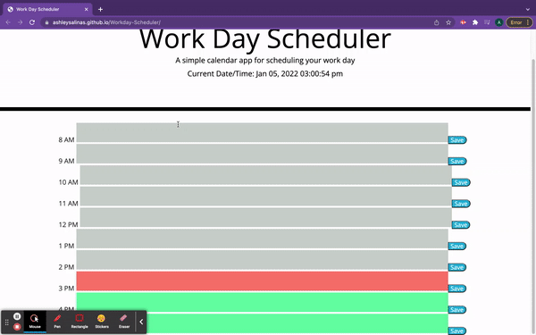

# Workday-Scheduler




Week 5 - Third Party APIs assignment for the Trilogy/Southern Methodist University Web Development Bootcamp

## About
A redo of the project assigned for Week 5 - Third Party APIs of the Trilogy/Southern Methodist University Web Development Bootcamp. Initial HTML/CSS files provided by instructors. However, all Javascript was written by yours truly. The project displays the current time with the current hour highlighted in red, past hours in gray, and future hours in green. Any notes saved to the time blocks will be saved using the browser's Local Storage.

## Built With
* HTML/CSS
* Javascript 
  * JQuery
  * Moment.js

## Getting Started
To use this app, you can follow <a href="https://ashleysalinas.github.io/Workday-Scheduler/"> this </a> link or you can use the steps below to clone a local copy.

### Local Copy Installation
  Step 1. Clone the repo
  ``` git clone https://github.com/ashleysalinas/Workday-Scheduler.git ```
  
  Step 2. CD into local copy folder 
  ``` cd (name of folder, usually just the name of the project) ```
  
  Step 3. Open folder in VSCode, and open the html file in your default browser. Enjoy!
  
  ## Usage
 Use this app to log daily tasks for a typical 8 AM - 5 PM workday. The app keeps track of current time and uses visual cues to diplay past, present, and current hours.
 
 ## License
 Distributed under the MIT Licencse.
 
 ## Acknowledgements
  As stated above, the initial html/css files, which included the header, were provided by the team at Trilogy Education Services.

